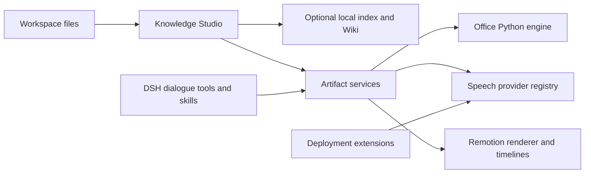

# Architecture



Studio owns source selection, citations, UI, saved artifacts and learning progress. The shared package has no dependency on Studio, Memory or a particular institution. DSH owns sessions, models, filesystem access, approvals and cancellation. `artifactServices` is registered once at Host scope; both Studio and tools use that instance. Assemblies can set `{skills:false}` and register the same six bundled skills through their product settings.

Shared Office tools are `office_document`, `office_spreadsheet`, `office_presentation`, `office_pdf`. Media tools are `speech_voices`, `speech_synthesize`, `media_render`, `video_project`. Write operations retain the original DSH Agent context and approval hooks. Low-level JavaScript APIs are intended for applications that enforce their own authorization and output directories.

## Application APIs

```js
import {runOffice, normalizeOfficeRequest} from '@eduwork/dsh-artifact-services/office'
import {SpeechService} from '@eduwork/dsh-artifact-services/speech'
import {renderMedia} from '@eduwork/dsh-artifact-services/media'
import {runVideoCommand} from '@eduwork/dsh-artifact-services/video-runner'
import {createMediaRuntime, getMediaFFmpegPath} from '@eduwork/dsh-artifact-services/runtime'
```

See the [shared package README](https://github.com/freedomkk-qfeng/dsh-knowledge-studio/blob/main/packages/artifact-services/README.md) for working request examples. A speech adapter implements `id`, `title`, `voices()` and `synthesize(request)`. The request carries exact text, voice, speed, an authorized directory, cancellation and optional ephemeral host execution context. Return an actual WAV file; the service measures its bytes to determine duration. Provider failures remain failures, with no silent vendor or voice substitution.

DSH extensions register through `ctx.artifactServices.registerSpeechProvider(provider)` and `registerBackgroundMusic(track)`, keeping credentials and governed vendor tools in the extension. Music entries include a file path, SHA-256 and provenance. Extensions dispose their registrations when unloaded.

Structured audio/video and editable React projects share the renderer and timing utilities. The editable starter is a distinct template, not another renderer. Existing legacy environment variables, project markers and historical audio formats remain supported; new generic narration uses WAV and a voice discovered from the provider registry.

## Persistence

The settings namespace remains `dsh-knowledge-studio`. Knowledge stays under `DSH_HOME/plugins/dsh-knowledge-studio/workspaces`; artifact metadata uses `artifacts.json`, with exports alongside it. Package scope changes do not rename these locations. Generated workspace jobs use `.artifacts/media` and editable projects retain the legacy `.ecnu-agent/video-projects` location to preserve existing project references.

Package/RPC ownership is `@eduwork/dsh-knowledge-studio`; the `knowledgeStudio` and `artifactServices` service identifiers and Cordis row IDs remain stable. No strong dependency on the Memory plugin is introduced.
